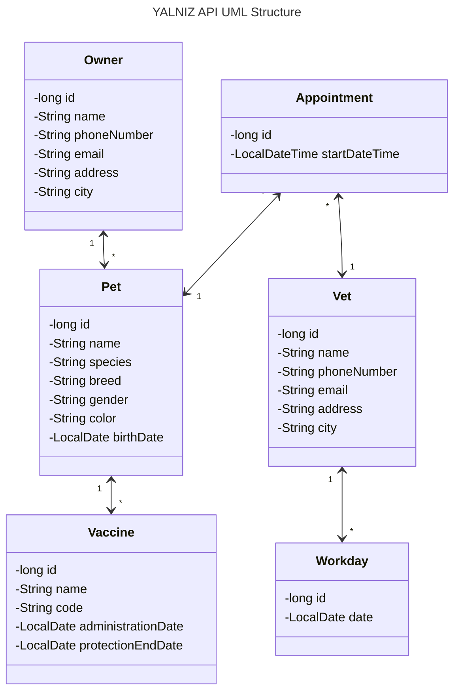

YALNIZ API - Veterinary Practice Management API
===============================================

## Table of Contents

- [About](#about)
- [API](#api)
- [UML structure](#uml-structure)
- [Request Body Templates](#request-body-templates)
  - [Pet](#pet)
  - [Owner](#owner)
  - [Vet](#vet)
  - [Vaccine](#vaccine)
  - [Appointment](#appointment)
  - [Workday](#workday)
- [What's in the name?](#whats-in-the-name)

## About

It is a RESTful API which is written in Java and Spring Boot.
It is a project for the bootcamp Patika+ given by [Patika](https://patika.dev).

## API

### Pets

| HTTP Method | HTTP Path                | Action             |
|-------------|--------------------------|--------------------|
| `GET`       | `/api/pets`              | get all pets       |
| `GET`       | `/api/pets/{id}`         | get pet by id      |
| `GET`       | `/api/pets/search?name=` | search pet by name |
| `POST`      | `/api/pets/`             | add new pet        |
| `PUT`       | `/api/pets/`             | update pet         |
| `DELETE`    | `/api/pets/{id}`         | delete pet         |

### Owners

| HTTP Method | HTTP Path                  | Action               |
|-------------|----------------------------|----------------------|
| `GET`       | `/api/owners`              | get all owners       |
| `GET`       | `/api/owners/{id}`         | get owner by id      |
| `GET`       | `/api/owners/search?name=` | search owner by name |
| `POST`      | `/api/owners/`             | add new owner        |
| `PUT`       | `/api/owners/`             | update owner         |
| `DELETE`    | `/api/owners/{id}`         | delete owner         |

### Vets

| HTTP Method | HTTP Path        | Action        |
|-------------|------------------|---------------|
| `GET`       | `/api/vets`      | get all vets  |
| `GET`       | `/api/vets/{id}` | get vet by id |
| `POST`      | `/api/vets/`     | add new vet   |
| `PUT`       | `/api/vets/`     | update vet    |
| `DELETE`    | `/api/vets/{id}` | delete vet    |

### Vaccinations

| HTTP Method | HTTP Path                                                               | Action                                   |
|-------------|-------------------------------------------------------------------------|------------------------------------------|
| `GET`       | `/api/vaccinations`                                                     | get all vaccines                         |
| `GET`       | `/api/vaccinations/{id}`                                                | get vaccine by id                        |
| `GET`       | `/api/vaccinations/ending-soon?startDate=YYYY-MM-dd&endDate=YYYY-MM-dd` | get vaccines ending in the given period  |
| `GET`       | `/api/vaccinations/of-pet/{pet-id}`                                     | get all vaccines administered to the pet |
| `POST`      | `/api/vaccinations/`                                                    | add new vaccination to the pet           |
| `PUT`       | `/api/vaccinations/`                                                    | update vaccination                       |
| `DELETE`    | `/api/vaccinations/{id}`                                                | delete vaccination                       |

### Appointments

| HTTP Method | HTTP Path                                               | Action                                      |
|-------------|---------------------------------------------------------|---------------------------------------------|
| `GET`       | `/api/appointments`                                     | get all appointments                        |
| `GET`       | `/api/vet/{id}?startDate=YYYY-MM-dd&endDate=YYYY-MM-dd` | get appointments of vet in the given period |
| `GET`       | `/api/pet/{id}?startDate=YYYY-MM-dd&endDate=YYYY-MM-dd` | get appointments of pet in the given period |
| `POST`      | `/api/appointments/`                                    | add new appointment                         |
| `PUT`       | `/api/appointments/`                                    | update appointment                          |
| `DELETE`    | `/api/appointments/{id}`                                | delete appointment                          |

### Workdays

| HTTP Method | HTTP Path            | Action            |
|-------------|----------------------|-------------------|
| `GET`       | `/api/workdays`      | get all workdays  |
| `GET`       | `/api/workdays/{id}` | get workday by id |
| `POST`      | `/api/workdays/`     | add new workday   |
| `PUT`       | `/api/workdays/`     | update workday    |
| `DELETE`    | `/api/workdays/{id}` | delete workday    |

## UML structure



## Request Body Templates

### Pet

The request body object is a modified version of the true Pet object.
It is called PetDto, for it does not contain the **vaccines** and **appointments** fields.

It is used for POST and PUT requests.

- For POST requests **id** and **ownerId** are optional.
- For PUT requests **id** is required.
  Note that **ownerId** is not required for PUT requests. If it is not provided, the owner of the pet will not be
  changed.

Additional notes:

* To change vaccines of a pet, use the [**Vaccinations**](#vaccinations) endpoint.
* To change appointments of a pet, use the [**Appointments**](#appointments) endpoint.

```json
{
  "id": null,
  "name": "string",
  "species": "string",
  "breed": "string",
  "gender": "string",
  "color": "string",
  "birthDate": "yyyy-MM-dd",
  "ownerId": null
}
```

### Owner

```json
{
  "id": null,
  "name": "string",
  "phoneNumber": "string",
  "email": "string",
  "address": "string",
  "city": "string"
}
```

### Vet

```json
{
  "id": null,
  "name": "string",
  "phoneNumber": "string",
  "email": "string",
  "address": "string",
  "city": "string"
}
```

### Vaccine

```json
{
  "id": null,
  "name": "string",
  "code": "string",
  "administrationDate": "yyyy-MM-dd",
  "protectionEndDate": "yyyy-MM-dd",
  "petId": null
}
```

### Appointment

```json
{
  "id": null,
  "startDateTime": "yyyy-MM-dd HH:mm",
  "vetId": null,
  "petId": null
}
```

### Workday

```json
{
  "id": null,
  "date": "yyyy-MM-dd",
  "vetId": null
}
```

## Starter Requests

See [starter-requests.http](starter-requests.http) file to run the requests below.

```http request
POST localhost:8080/api/owners/
Content-Type: application/json

{
"id": null,
"name": "Rıfat",
"phoneNumber": "+154895468764",
"email": "rifatboi@gmail.com",
"address": "Soygun Mah. Muza Binmiş Sok. 5/74",
"city": "Kestanbul"
}

###
POST localhost:8080/api/pets/
Content-Type: application/json

{
"id": null,
"name": "rıfkı",
"species": "kara kaplumbağası",
"breed": "kaplumbağa",
"gender": "dişi",
"color": "kahve",
"birthDate": "2023-10-11",
"ownerId": 1
}

###
POST localhost:8080/api/vets/
Content-Type: application/json

{
"id": null,
"name": "Halim",
"phoneNumber": "+154897824",
"email": "dr-halim@daclinic.com",
"address": "Soygun Mah. Muza Binmiş Sok. 1/2",
"city": "Kestanbul"
}

###
POST localhost:8080/api/workdays/
Content-Type: application/json

{
"id": null,
"date": "2024-01-01",
"vetId": 1
}

###
POST localhost:8080/api/appointments/
Content-Type: application/json

{
"id": null,
"startDateTime": "2024-01-01T15:00",
"petId": 1,
"vetId": 1
}

###
POST localhost:8080/api/vaccinations/
Content-Type: application/json

{
"id": null,
"name": "Biontech",
"code": "Bpet98",
"administrationDate": "2024-01-01",
"protectionEndDate": "2025-01-01",
"petId": 1
}
```

## What's in the name?

YALNIZ was the name I gave to a cat. She was a little one,
wandering **ALONE** in the forest where she saw me and ran in the hope of finding a _possibly a new_ home.
She was a very cute and lovely cat. Could not bring her with me when I got back to the city.

One day, when I came back to the village, she was gone. Nowhere to be found.
Then I heard from the folks around. They told me that she was a strong one.
That she would bully the other cats in the village. That she was a fighter. That she was a survivor.
Yet she was found dead by the road, lived **YALNIZ** and died **ALONE**.

In the memory of YALNIZ, I named this project after her.
