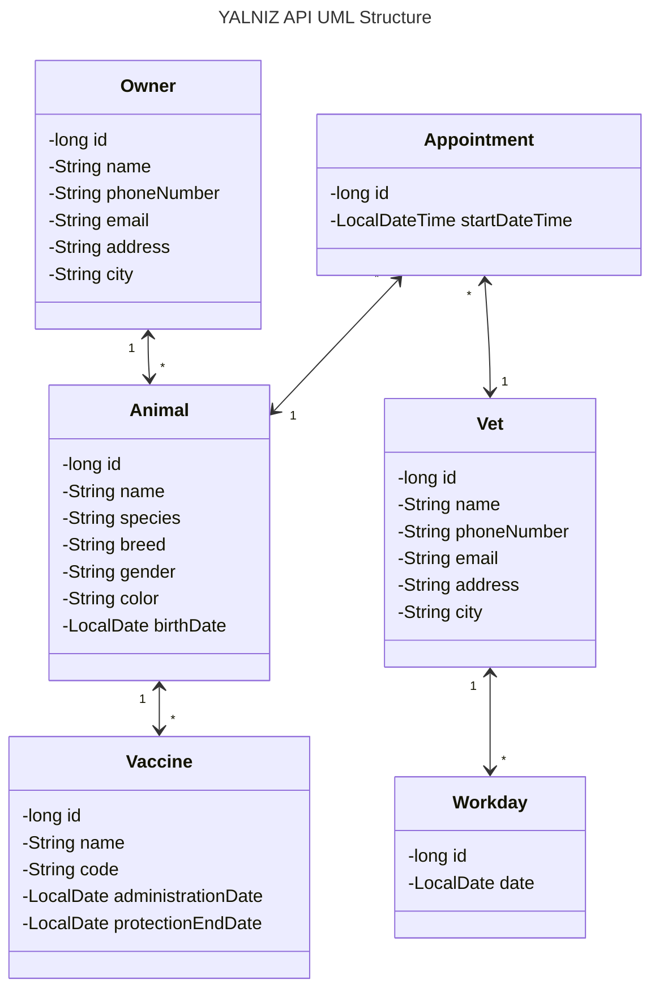

YALNIZ API - Veterinary Practice Management API
===============================================

## Table of Contents

- [About](#about)
- [API](#api)
- [UML structure](#uml-structure)
- [Request Body Templates](#request-body-templates)
  - [Animal](#pet)
  - [Owner](#owner)
  - [Vet](#vet)
  - [Vaccine](#vaccine)
  - [Appointment](#appointment)
  - [Workday](#workday)
- [What's in the name?](#whats-in-the-name)

## About

It is a RESTful API which is written in Java and Spring Boot.
It is a project for the bootcamp Patika+ given by [Patika](https://patika.dev).

## API

### Pets

| HTTP Method | HTTP Path                 | Action              |
|-------------|---------------------------|---------------------|
| `GET`       | `/api/pets`               | get all pets        |
| `GET`       | `/api/pets/{id}`          | get pet by id       |
| `GET`       | `/api/pets/search`        | search pet by name  | 
| `GET`       | `/api/pets/{id}/vaccines` | get vaccines of pet |
| `POST`      | `/api/pets`               | add new pet         |
| `PUT`       | `/api/pets/{id}`          | update pet          |
| `DELETE`    | `/api/pets/{id}`          | delete pet          |

### Owners

| HTTP Method | HTTP Path               | Action               |
|-------------|-------------------------|----------------------|
| `GET`       | `/api/owners`           | get all owners       |
| `GET`       | `/api/owners/{id}`      | get owner by id      |
| `GET`       | `/api/owners/search`    | search owner by name |
| `GET`       | `/api/owners/{id}/pets` | get pets of owner    |
| `POST`      | `/api/owners`           | add new owner        |
| `PUT`       | `/api/owners/{id}`      | update owner         |
| `DELETE`    | `/api/owners/{id}`      | delete owner         |

### Vets

| HTTP Method | HTTP Path             | Action             |
|-------------|-----------------------|--------------------|
| `GET`       | `/api/vets`           | get all vets       |
| `GET`       | `/api/vets/{id}`      | get vet by id      |
| `GET`       | `/api/vets/{id}/days` | get days of vet    |
| `GET`       | `/api/vets/search`    | search vet by name |
| `POST`      | `/api/vets`           | add new vet        |
| `PUT`       | `/api/vets/{id}`      | update vet         |
| `DELETE`    | `/api/vets/{id}`      | delete vet         |

### Vaccines

| HTTP Method | HTTP Path                | Action                              |
|-------------|--------------------------|-------------------------------------|
| `GET`       | `/api/vaccines/{pet-id}` | get all vaccines applied to the pet |
| `POST`      | `/api/vaccines/{pet-id}` | add new vaccination to the pet      |
| `PUT`       | `/api/vaccines/{id}`     | update vaccination                  |
| `DELETE`    | `/api/vaccines/{id}`     | delete vaccination                  |

### Appointments

| HTTP Method | HTTP Path                  | Action                                        |
|-------------|----------------------------|-----------------------------------------------|
| `GET`       | `/api/appointments`        | get all appointments                          |
| `GET`       | `/api/appointments/{id}`   | get appointment by id                         |
| `GET`       | `/api/appointments/search` | search appointments by pet name AND/OR period |
| `POST`      | `/api/appointments`        | add new appointment                           |
| `PUT`       | `/api/appointments/{id}`   | update appointment                            |
| `DELETE`    | `/api/appointments/{id}`   | delete appointment                            |

### Workdays

| HTTP Method | HTTP Path              | Action                                    |
|-------------|------------------------|-------------------------------------------|
| `GET`       | `/api/workdays`        | get all workdays                          |
| `GET`       | `/api/workdays/{id}`   | get workday by id                         |
| `GET`       | `/api/workdays/search` | search workdays by vet name AND/OR period |
| `POST`      | `/api/workdays`        | add new workday                           |
| `PUT`       | `/api/workdays/{id}`   | update workday                            |
| `DELETE`    | `/api/workdays/{id}`   | delete workday                            |

## UML structure



## Request Body Templates

### Animal

The request body object is a modified version of the true Animal object.
It is called AnimalBasicDto, for it does not contain the **vaccines** and **appointments** fields.

It is used for POST and PUT requests.

- For POST requests **id** and **ownerId** are optional.
- For PUT requests **id** is required.
  Note that **ownerId** is not required for PUT requests. If it is not provided, the owner of the pet will not be
  changed.

Additional notes:

* To change vaccines of a pet, use the [**Vaccines**](#vaccines) endpoint.
* To change appointments of a pet, use the [**Appointments**](#appointments) endpoint.

```javascript
[
    {
        "id": null,
        "name": "string",
        "species": "string",
        "breed": "string",
        "gender": "string",
        "color": "string",
        "birthDate": "yyyy-MM-dd",
        "ownerId": null,
    }
]
```

### Owner

```javascript
[
    {
        "id": null,
        "name": "string",
        "phoneNumber": "string",
        "email": "string",
        "address": "string",
        "city": "string",
    }
]
```

### Vet

```javascript
[
    {
        "id": null,
        "name": "string",
        "phoneNumber": "string",
        "email": "string",
        "address": "string",
        "city": "string",
    }
]
```

### Vaccine

```javascript
[
    {
        "id": null,
        "name": "string",
        "code": "string",
        "administrationDate": "yyyy-MM-dd",
        "protectionEndDate": "yyyy-MM-dd",
        "animalId": null,
    }
]
```

### Appointment

```javascript
[
    {
        "id": null,
        "startDateTime": "yyyy-MM-dd HH:mm",
        "vetId": null,
        "animalId": null,
    }
]
```

### Workday

```javascript
[
    {
        "id": null,
        "date": "yyyy-MM-dd",
        "vetId": null,
    }
]
```

## What's in the name?

YALNIZ was the name I gave to a cat. She was a little one,
wandering **ALONE** in the forest where she saw me and ran in the hope of finding a _possibly a new_ home.
She was a very cute and lovely cat. Could not bring her with me when I got back to the city.

One day, when I came back to the village, she was gone. Nowhere to be found.
Then I heard from the folks around. They told me that she was a strong one.
That she would bully the other cats in the village. That she was a fighter. That she was a survivor.
Yet she was found dead by the road, lived **YALNIZ** and died **ALONE**.

In the memory of YALNIZ, I named this project after her.
