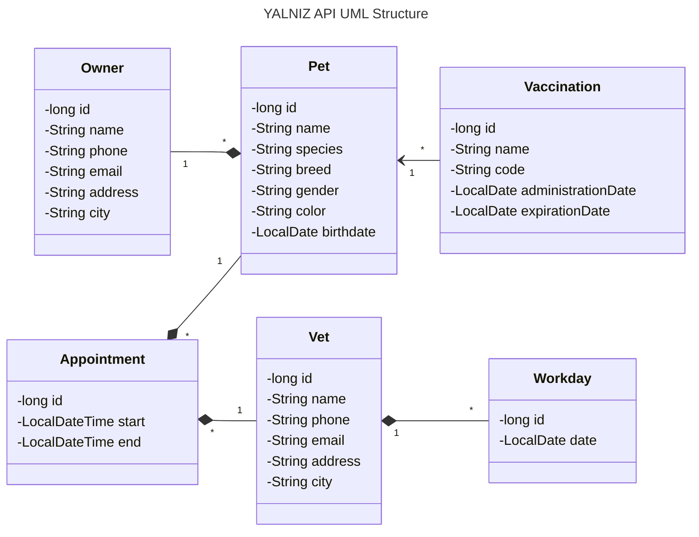

YALNIZ API - Veterinary Practice Management API
===============================================

Yalnız Api is a RESTful API in monolithic architecture written in Java and Spring Boot.
Production database is PostgreSQL. For testing purposes, though, you may use H2 Embedded database as it is currently
configured.

This project was originally developed as the capstone project of Java Spring Boot module
of Patika+ Java/React FullStack Web Development bootcamp organized by [Patika](https://patika.dev).

For the mentioned bootcamp's final capstone project (which can be found [here](https://github.com/gokdenizozkan/yalniz-app)), it was revised and extended to include more features.
This repository, with version 2.0.0 and above, is the updated version of the project, and will only include backend
codes.
To see the old version, please switch back to v1.0.0.

The final capstone project also requires a frontend part, which is a React application. However, this is out of topic
for this repository.

## Table of Contents

- [About](#yalniz-api---veterinary-practice-management-api)
- [What's in the name?](#whats-in-the-name)
- [How to test the project](#how-to-test-the-project)
- [APIs](#apis)
- [UML structure](#uml-structure)
- [Request Body Templates](#request-body-templates)
    - [Appointment](#appointment)
    - [Owner](#owner)
    - [Pet](#pet)
    - [Vaccination](#vaccination)
    - [Vet](#vet)
    - [Workday](#workday)

## What's in the name?

YALNIZ was the name I gave to a cat. She was a little one,
wandering **ALONE** in the forest where she saw me and ran in the hope of finding a new home.
She was a very cute and lovely cat. Could not bring her with me when I got back to the city.

One day, when I came back to the village, she was gone. Nowhere to be found.
Then I heard from the folks around. They told me that she was a strong one.
That she would bully the other cats in the village. That she was a fighter. That she was a survivor.
Yet she was found dead by the road, lived **YALNIZ** and died **ALONE**.

In the memory of YALNIZ, I named this project after her.

## How to test the project

To run the project,

- install Java 21.
- clone the repository.
- open your favorite IDE and import the project as a Maven project.

After starting the application, you can test the by sending requests to the API.
This document will be updated to add an http file to populate the database with mock data.

## UML structure



## APIs

Here is the detailed documentation of all API endpoints:

### Owner

[Response object](#owner-response)

| HTTP Method | HTTP Path                     | Action                | Request Body Template        |
|-------------|-------------------------------|-----------------------|------------------------------|
| `GET`       | `/api/v2/owners`              | Get all owners        | N/A                          |
| `GET`       | `/api/v2/owners/{id}`         | Get owner by id       | N/A                          |
| `GET`       | `/api/v2/owners/search?name=` | Search owner by name  | N/A                          |
| `GET`       | `/api/v2/owners/{id}/pets`    | Get pets of the owner | N/A                          |
| `POST`      | `/api/v2/owners`              | Add new owner         | [rbt](#owner-save-request)   |
| `PUT`       | `/api/v2/owners/{id}`         | Update owner          | [rbt](#owner-update-request) |
| `DELETE`    | `/api/v2/owners/{id}`         | Delete owner          | N/A                          |

### Pet

[Response object](#pet-response)

| HTTP Method | HTTP Path                   | Action             | Request Body Template      |
|-------------|-----------------------------|--------------------|----------------------------|
| `GET`       | `/api/v2/pets`              | Get all pets       | N/A                        |
| `GET`       | `/api/v2/pets/{id}`         | Get pet by id      | N/A                        |
| `GET`       | `/api/v2/pets/search?name=` | Search pet by name | N/A                        |
| `POST`      | `/api/v2/pets`              | Add new pet        | [rbt](#pet-save-request)   |
| `PUT`       | `/api/v2/pets/{id}`         | Update pet         | [rbt](#pet-update-request) |
| `DELETE`    | `/api/v2/pets/{id}`         | Delete pet         | N/A                        |

### Vet

[Response object](#vet-response)

| HTTP Method | HTTP Path           | Action        | Request Body Template      |
|-------------|---------------------|---------------|----------------------------|
| `GET`       | `/api/v2/vets`      | Get all vets  | N/A                        |
| `GET`       | `/api/v2/vets/{id}` | Get vet by id | N/A                        |
| `POST`      | `/api/v2/vets`      | Add new vet   | [rbt](#vet-save-request)   |
| `PUT`       | `/api/v2/vets/{id}` | Update vet    | [rbt](#vet-update-request) |
| `DELETE`    | `/api/v2/vets/{id}` | Delete vet    | N/A                        |

### Workday

[Response object](#workday-response)

| HTTP Method | HTTP Path               | Action            | Request Body Template          |
|-------------|-------------------------|-------------------|--------------------------------|
| `GET`       | `/api/v2/workdays`      | Get all workdays  | N/A                            |
| `GET`       | `/api/v2/workdays/{id}` | Get workday by id | N/A                            |
| `POST`      | `/api/v2/workdays`      | Add new workday   | [rbt](#workday-save-request)   |
| `PUT`       | `/api/v2/workdays/{id}` | Update workday    | [rbt](#workday-update-request) |
| `DELETE`    | `/api/v2/workdays/{id}` | Delete workday    | N/A                            |

### Appointment

[Response object](#appointment-response)

| HTTP Method | HTTP Path                                                                     | Action                                      | Request Body Template              |
|-------------|-------------------------------------------------------------------------------|---------------------------------------------|------------------------------------|
| `GET`       | `/api/v2/appointments`                                                        | Get all appointments                        | N/A                                |
| `GET`       | `/api/v2/appointments/of-vet/{vetId}?startDate=yyyy-MM-dd&endDate=yyyy-MM-dd` | Get appointments of vet in the given period | N/A                                |
| `GET`       | `/api/v2/appointments/of-pet/{petId}?startDate=yyyy-MM-dd&endDate=yyyy-MM-dd` | Get appointments of pet in the given period | N/A                                |
| `POST`      | `/api/v2/appointments`                                                        | Add new appointment                         | [rbt](#appointment-save-request)   |
| `PUT`       | `/api/v2/appointments`                                                        | Update appointment                          | [rbt](#appointment-update-request) |
| `DELETE`    | `/api/v2/appointments/{id}`                                                   | Delete appointment                          | N/A                                |

### Vaccination

[Response object](#vaccination-response)

| HTTP Method | HTTP Path                                                                  | Action                                   | Request Body Template              |
|-------------|----------------------------------------------------------------------------|------------------------------------------|------------------------------------|
| `GET`       | `/api/v2/vaccinations`                                                     | Get all vaccines                         | N/A                                |
| `GET`       | `/api/v2/vaccinations/{id}`                                                | Get vaccine by id                        | N/A                                |
| `GET`       | `/api/v2/vaccinations/ending-soon?startDate=yyyy-MM-dd&endDate=yyyy-MM-dd` | Get vaccines ending in the given period  | N/A                                |
| `GET`       | `/api/v2/vaccinations/of-pet/{petId}`                                      | Get all vaccines administered to the pet | N/A                                |
| `POST`      | `/api/v2/vaccinations`                                                     | Add new vaccination to the pet           | [rbt](#vaccination-save-request)   |
| `PUT`       | `/api/v2/vaccinations/{id}`                                                | Update vaccination                       | [rbt](#vaccination-update-request) |
| `DELETE`    | `/api/v2/vaccinations/{id}`                                                | Delete vaccination                       | N/A                                |

## Request Body Templates

### Appointment

#### Appointment Save Request

```json
{
  "start": "yyyy-MM-dd'T'HH:mm:ss",
  "petId": 1,
  "vetId": 1
}
```

#### Appointment Update Request

```json
{
  "id": 1,
  "start": "yyyy-MM-dd'T'HH:mm:ss",
  "petId": 1,
  "vetId": 1
}
```

#### Appointment Response

```json
{
  "id": 1,
  "start": "yyyy-MM-dd'T'HH:mm:ss",
  "petId": 1,
  "vetId": 1
}
```

### Owner

#### Owner Save Request

```json
{
  "name": "string",
  "phone": "string",
  "email": "string",
  "address": "string",
  "city": "string"
}
```

#### Owner Update Request

```json
{
  "id": 1,
  "name": "string",
  "phone": "string",
  "email": "string",
  "address": "string",
  "city": "string"
}
```

#### Owner Response

*pets array has [PetResponse](#pet-response) objects.

```json
{
  "id": 1,
  "name": "string",
  "phone": "string",
  "email": "string",
  "address": "string",
  "city": "string",
  "pets": []
}
```

### Pet

#### Pet Save Request

```json
{
  "name": "string",
  "species": "string",
  "breed": "string",
  "gender": "string",
  "color": "string",
  "birthdate": "yyyy-MM-dd",
  "ownerId": 1
}
```

#### Pet Update Request

```json
{
  "id": 1,
  "name": "string",
  "species": "string",
  "breed": "string",
  "gender": "string",
  "color": "string",
  "birthdate": "yyyy-MM-dd",
  "ownerId": 1
}
```

#### Pet Response

```json
{
  "id": 1,
  "name": "string",
  "species": "string",
  "breed": "string",
  "gender": "string",
  "color": "string",
  "birthdate": "yyyy-MM-dd",
  "ownerId": 1
}
```

### Vaccination

#### Vaccination Save Request

```json
{
  "name": "string",
  "code": "string",
  "administrationDate": "yyyy-MM-dd",
  "expirationDate": "yyyy-MM-dd",
  "petId": 1
}
```

#### Vaccination Update Request

```json
{
  "id": 1,
  "name": "string",
  "code": "string",
  "administrationDate": "yyyy-MM-dd",
  "expirationDate": "yyyy-MM-dd",
  "petId": 1
}
```

#### Vaccination Response

```json
{
  "id": 1,
  "name": "string",
  "code": "string",
  "administrationDate": "yyyy-MM-dd",
  "expirationDate": "yyyy-MM-dd",
  "petId": 1
}
```

### Vet

#### Vet Save Request

```json
{
  "name": "string",
  "phone": "string",
  "email": "string",
  "address": "string",
  "city": "string"
}
```

#### Vet Update Request

```json
{
  "id": 1,
  "name": "string",
  "phone": "string",
  "email": "string",
  "address": "string",
  "city": "string"
}
```

#### Vet Response

```json
{
  "id": 1,
  "name": "string",
  "phone": "string",
  "email": "string",
  "address": "string",
  "city": "string"
}
```

### Workday

#### Workday Save Request

```json
{
  "date": "yyyy-MM-dd",
  "vetId": 1
}
```

#### Workday Update Request

```json
{
  "id": 1,
  "date": "yyyy-MM-dd",
  "vetId": 1
}
```

#### Workday Response

```json
{
  "id": 1,
  "date": "yyyy-MM-dd",
  "vetId": 1
}
```