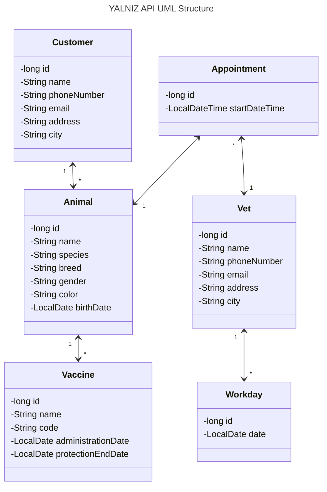

YALNIZ API - Veterinary Practice Management API
===============================================

## Table of Contents

- [About](#about)
- [API](#api)
- [UML structure](#uml-structure)
- [What's in the name?](#whats-in-the-name)

## About

It is a RESTful API which is written in Java and Spring Boot.
It is a project for the bootcamp Patika+ given by [Patika](https://patika.dev).

## API

### Animals

| HTTP Method | HTTP Path                    | Action                 |
|-------------|------------------------------|------------------------|
| `GET`       | `/api/animals`               | get all animals        |
| `GET`       | `/api/animals/{id}`          | get animal by id       |
| `GET`       | `/api/animals/search`        | search animal by name  | 
| `GET`       | `/api/animals/{id}/vaccines` | get vaccines of animal |
| `POST`      | `/api/animals`               | add new animal         |
| `PUT`       | `/api/animals/{id}`          | update animal          |
| `DELETE`    | `/api/animals/{id}`          | delete animal          |

### Customers

| HTTP Method | HTTP Path                     | Action                  |
|-------------|-------------------------------|-------------------------|
| `GET`       | `/api/customers`              | get all customers       |
| `GET`       | `/api/customers/{id}`         | get customer by id      |
| `GET`       | `/api/customers/search`       | search customer by name |
| `GET`       | `/api/customers/{id}/animals` | get animals of customer |
| `POST`      | `/api/customers`              | add new customer        |
| `PUT`       | `/api/customers/{id}`         | update customer         |
| `DELETE`    | `/api/customers/{id}`         | delete customer         |

### Vets

| HTTP Method | HTTP Path             | Action             |
|-------------|-----------------------|--------------------|
| `GET`       | `/api/vets`           | get all vets       |
| `GET`       | `/api/vets/{id}`      | get vet by id      |
| `GET`       | `/api/vets/{id}/days` | get days of vet    |
| `GET`       | `/api/vets/search`    | search vet by name |
| `POST`      | `/api/vets`           | add new vet        |
| `PUT`       | `/api/vets/{id}`      | update vet         |
| `DELETE`    | `/api/vets/{id}`      | delete vet         |

### Vaccines

| HTTP Method | HTTP Path                   | Action                                 |
|-------------|-----------------------------|----------------------------------------|
| `GET`       | `/api/vaccines/{animal-id}` | get all vaccines applied to the animal |
| `POST`      | `/api/vaccines/{animal-id}` | add new vaccination to the animal      |
| `PUT`       | `/api/vaccines/{id}`        | update vaccination                     |
| `DELETE`    | `/api/vaccines/{id}`        | delete vaccination                     |

### Appointments

| HTTP Method | HTTP Path                  | Action                                           |
|-------------|----------------------------|--------------------------------------------------|
| `GET`       | `/api/appointments`        | get all appointments                             |
| `GET`       | `/api/appointments/{id}`   | get appointment by id                            |
| `GET`       | `/api/appointments/search` | search appointments by animal name AND/OR period |
| `POST`      | `/api/appointments`        | add new appointment                              |
| `PUT`       | `/api/appointments/{id}`   | update appointment                               |
| `DELETE`    | `/api/appointments/{id}`   | delete appointment                               |

### Workdays

| HTTP Method | HTTP Path              | Action                                    |
|-------------|------------------------|-------------------------------------------|
| `GET`       | `/api/workdays`        | get all workdays                          |
| `GET`       | `/api/workdays/{id}`   | get workday by id                         |
| `GET`       | `/api/workdays/search` | search workdays by vet name AND/OR period |
| `POST`      | `/api/workdays`        | add new workday                           |
| `PUT`       | `/api/workdays/{id}`   | update workday                            |
| `DELETE`    | `/api/workdays/{id}`   | delete workday                            |

## UML structure

## What's in the name?

YALNIZ was the name I gave to a cat. She was a little one,
wandering **ALONE** in the forest where she saw me and ran in the hope of finding a _possibly a new_ home.
She was a very cute and lovely cat. Could not bring her with me when I got back to the city.

One day, when I came back to the village, she was gone. Nowhere to be found.
Then I heard from the folks around. They told me that she was a strong one.
That she would bully the other cats in the village. That she was a fighter. That she was a survivor.
Yet she was found dead by the road, lived **YALNIZ** and died **ALONE**.

In the memory of YALNIZ, I named this project after her.
